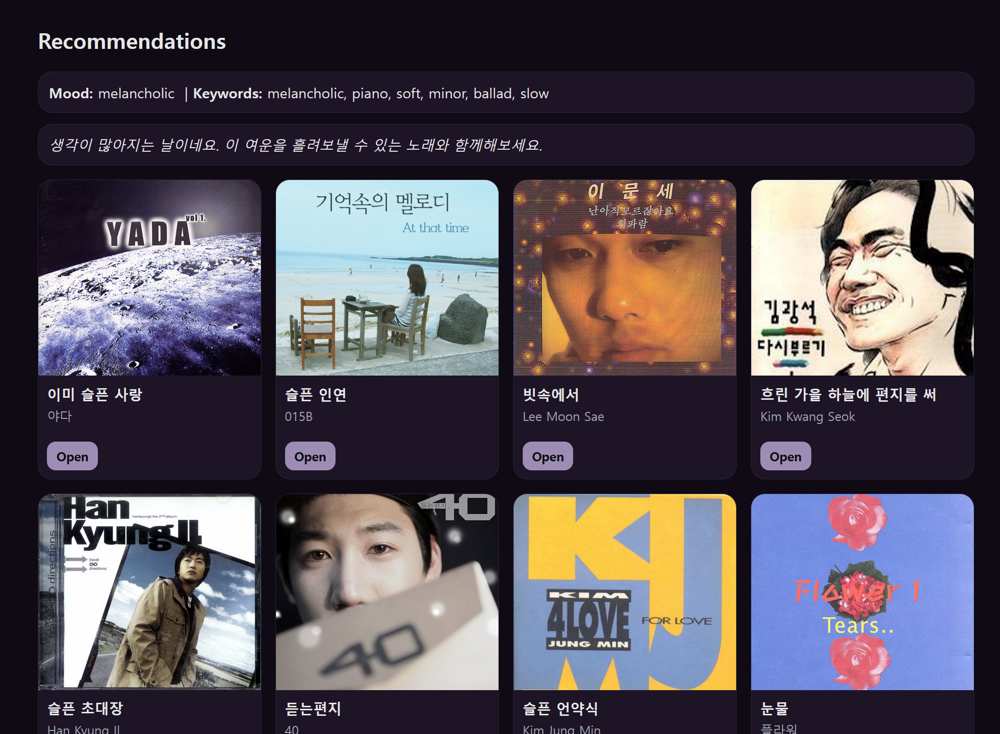
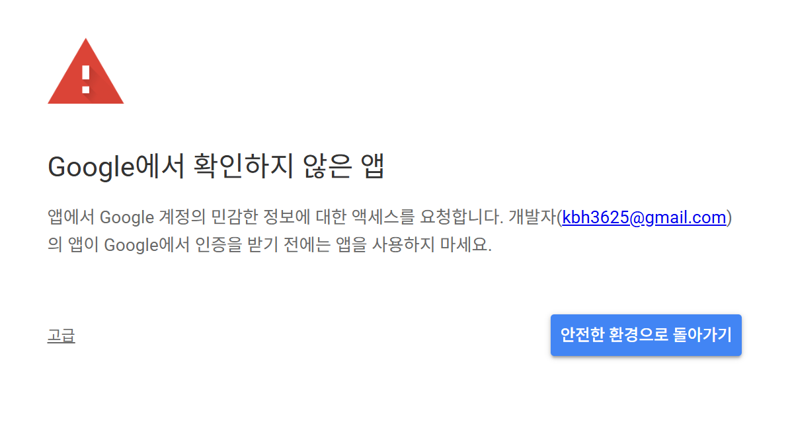
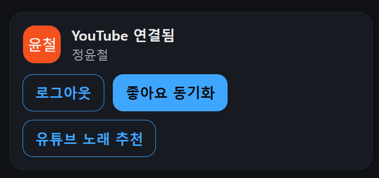

**메인 화면** 


---
**일기 작성 화면**


메인 화면에서 Start Diary 버튼을 누르면 해당 화면으로 넘어갑니다.


---
**감정 분석 및 음악 추천**

아래와 같이 각각의 감정에 따른 노래 추천이 원할하게 진행될 수 있도록 저희가 선정한 8가지 감정에 각각의 감정에 대응하는 키워드를 추가해줬습니다.

```javascript
const MOOD_KR = {
  happy: ["신나는", "기분전환", "여행", "드라이브", "아이돌", "청량한"],
  sad: ["슬픈", "이별", "발라드", "새벽", "눈물", "그리움"],
  angry: ["스트레스", "힙합", "강렬한", "락", "터지는"],
  calm: ["잔잔한", "새벽감성", "카페", "힐링", "어쿠스틱", "잠잘때"],
  energetic: ["운동", "노동요", "텐션", "파이팅", "댄스", "동기부여"],
  romantic: ["사랑", "설렘", "고백", "데이트", "달달한", "썸"],
  melancholic: ["우울", "비오는날", "센치한", "위로", "혼자"],
  focused: ["공부", "집중", "독서", "피아노", "노동요"],
};

const MOOD_SUB_GENRES = {
  happy: ["dance", "pop"],
  sad: ["ballad", "r-n-b"],
  angry: ["hip-hop", "rock"],
  calm: ["acoustic", "indie"],
  energetic: ["dance", "electronic", "hip-hop"],
  romantic: ["r-n-b", "soul"],
  melancholic: ["r-n-b", "indie"],
  focused: ["piano", "jazz"],
};

```
또한 노래 추천 과정에서 있었던 문제들을 정리해보면

1. 스포티파이 기업 자체가 한국 노래보단 외국 노래 및 가수의 인기도가 높게 책정되어 있음.
2. '1'의 이유로 한국 노래가 제대로 추천이 안됨
3. 같은 가수의 노래가 추천 곡의 절반 이상을 차지 하는 경우가 있다

위의 문제들을 해결하기 위해서, 기존의 텍스트와 인기도 중심으로만 추천하던 노래 추천 방식을 
아래의 코드 처럼 개선 하였습니다.

```javascript
function scoreTrack(t, { keywords = [], genres = [], mood = "" }) {
  // 점수(한글/최신/인기도/감정 키워드) + 기존 점수(키워드 매칭/프리뷰) 혼합
  const title = t.title || "";
  const titleLower = title.toLowerCase();
  const artistsStr = (t.artists || []).join(" ");
  const artistsLower = artistsStr.toLowerCase();
  const albumLower = (t.albumName || "").toLowerCase();

  let s = 0;

  // 한글 포함 가산점
  if (hasKorean(title) || hasKorean(artistsStr)) s += 20;

  // 인기도 반영(가중치 너무 커지지 않게 0.5)
  s += (t.popularity || 0) * 0.5;

  // 최신곡 가산점
  if (isRecent(t.releaseDate)) s += 10;

  // 키워드 매칭(제목/아티스트)
  for (const k of keywords || []) {
    const kw = String(k || "").toLowerCase().trim();
    if (!kw) continue;
    if (titleLower.includes(kw) || artistsLower.includes(kw)) s += 10;
  }

  // 장르 문자열 약가산(앨범명/제목에 감정별로 설정해둔 키워드가 들어가면 가산점)
  for (const g of genres || []) {
    const gg = String(g || "").toLowerCase().trim();
    if (!gg) continue;
    if (titleLower.includes(gg) || albumLower.includes(gg)) s += 5;
  }

  return s;
}

```


아래는 음악 추천 화면입니다 음악의 음악의 표지 , 제목, 가수를 보여줍니다.



melancholic, 우울의 감정과 대응되는 노래들이 추천이 제대로 진행되고 있음을
확인했습니다.


**open** 버튼을 누르면 해당 노래의 spotify 공식 홈페이지로 이동합니다.

---
**좋아요 기반 YouTube 노래 추천**
해당 기능은 구글 로그인을 진행 후에 사용이 가능합니다.



로그인 시도 시 위와 같은 경고문이 나오는데,
좌측 하단 "고급" 탭을 클릭하고, "TEST(으)로 이동(안전하지 않음)" 
클릭 후에 로그인 시도하면 정상적으로 로그인 됩니다.



로그인이 성공적으로 메인화면 우측 상단 탭에 위처럼 연결이 됩니다.
이후 좋아요 동기화를 누르고, 3~5분 정도 기다리신 후 "유튜브 노래 추천"을 클릭하면
아래와 같이 사용자가 좋아요를 눌렀던 "음악" 영상들을 검색해서 노래 추천을 진행합니다.


---
updated  2025/12/16
