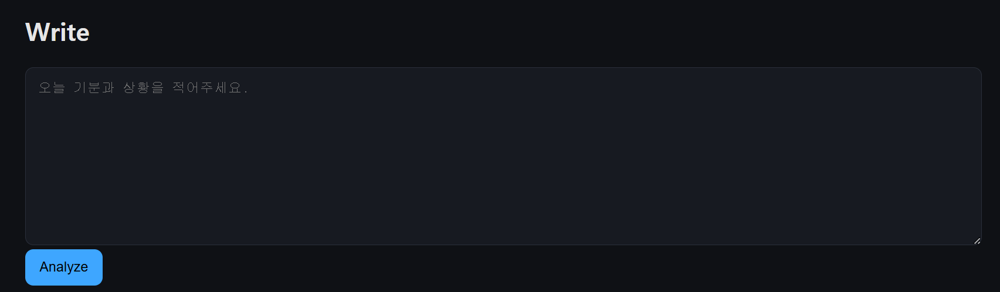
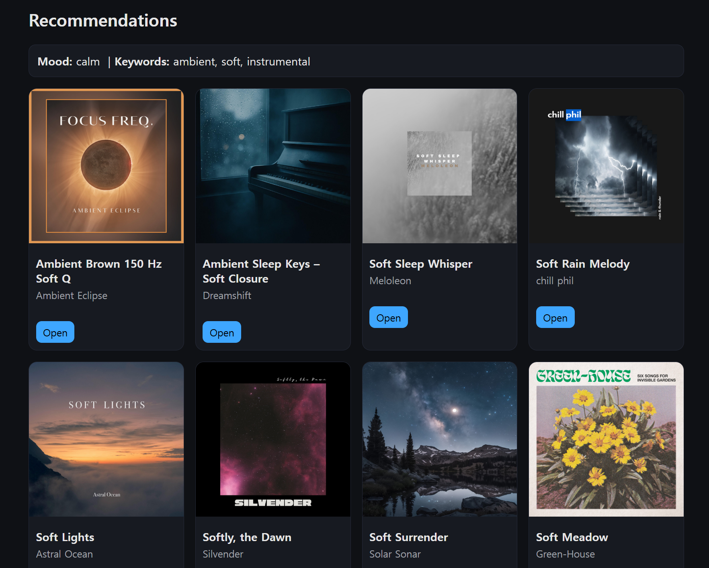
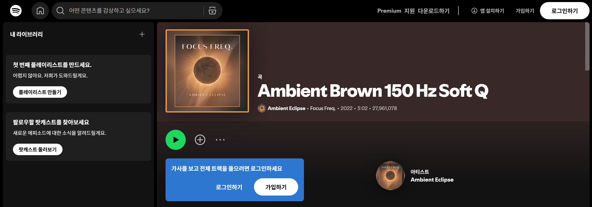

**메인 화면** 


---
**일기 작성 화면**



메인 화면에서 Start Diary 버튼을 누르면 해당 화면으로 넘어갑니다.


---
**감정 분석**
사용자가 일기를 작성 한 뒤에 **"analyze"** 버튼을 누르면, 분석할 일기의 텍스트를 gpt 모델에게 전달 후, openAi API를 이용해서 energy와 valence 값을 받아서 값에 따라서 아래의 코드블록 처럼 Mood를 설정하도록 구현했습니다.

```javascript
// mood → target audio profile
const MOOD_TARGET = {
  happy:      { energy: 0.7, valence: 0.8 },
  sad:        { energy: 0.3, valence: 0.2 },
  angry:      { energy: 0.9, valence: 0.2 },
  calm:       { energy: 0.25, valence: 0.6 },
  energetic:  { energy: 0.85, valence: 0.7 },
  romantic:   { energy: 0.4, valence: 0.75 },
  melancholic:{ energy: 0.35, valence: 0.3 },
  focused:    { energy: 0.35, valence: 0.55 }
};
```


---
**음악 추천**

일기의 감정이 분석이 완료되서 mood, energy, valence가 정해지면 해당 값들과 spotify API를 이용해서 음악 탐색을 진행합니다. 

기본적으로 20개의 노래를 추천하며, 20개의 노래마다 각각의 점수를 부여해서 점수의 내림차순 기준으로 노래를 정렬합니다. 


<h6 style= "color: blue">점수 기반 추천 기능</h6>

```javascript

일기의 텍스트가 음악의 제목이나 가수의 이름에 들어 있으면 점수를 주고, 
가수의 인기에 따라서 점수를 주는 방법도 추가했습니다

텍스트가 일치하는 경우의 가중치는 8
인기는 가중치를 0.1 로 세팅했습니다. 

function score(track, { keywords }) {
  let s = 0;

  // 텍스트 매칭
  const title = (track.title || "").toLowerCase();
  const artists = (track.artists || []).join(" ").toLowerCase();
  for (const k of keywords || []) {
    const kw = String(k).toLowerCase();
    if (kw && (title.includes(kw) || artists.includes(kw))) s += 8;
  }

  s += (track.popularity || 0) * 0.1;
  return s;
}
```



음악 추천 화면입니다 음악의 간단한 이미지, 제목, 가수를 보여줍니다.



**open** 버튼을 누르면 이와 같이 해당 노래를 play 해볼 수 있는 spotify 공식 홈페이지로 이동합니다.


---
update  2025/11/14 22:49
