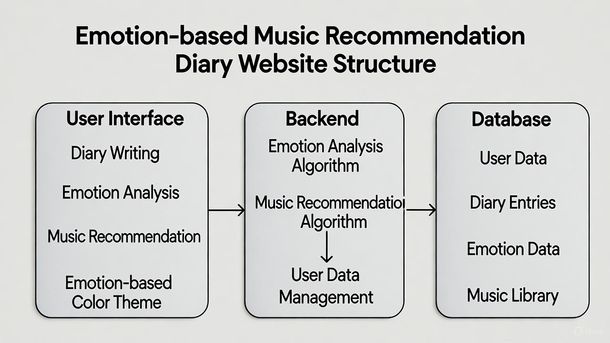
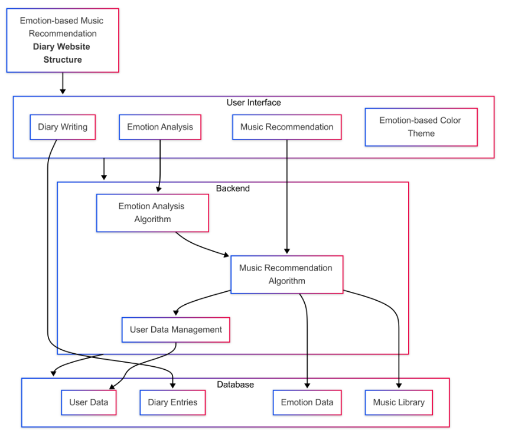

# 🎵 감정 기반 음악 추천 일기 (Emotion-based Music Diary)
---


## 🧠 Abstract

**음악 추천 기반 감정 일기**는 사용자가 작성한 일기 내용을 분석하여 감정에 맞는 음악을 추천해주는 감성형 웹 애플리케이션입니다.  
인공지능을 사용해서, **키워드 매칭 기반 감정 분석**을 사용하여 구현의 단순성과 효율성을 동시에 추구합니다.  
사용자는 하루의 감정을 일기로 남기고, 해당 감정에 어울리는 음악과 컬러 테마를 통해 감정적인 피드백을 받을 수 있습니다.

---

## 🖼️ Project Overview




## 🧩 Core Features

- ✍️ **일기 작성 기능** – 사용자가 자유롭게 일기를 작성할 수 있음  
- 💬 **감정 분석 기능** – open AI로 감정을 분류  
- 🎶 **음악 추천 기능** – 감정에 맞는 음악 리스트 출력 (DB 또는 API 기반)  
- 🎨 **감정별 컬러 테마 UI** – 감정에 따라 달라지는 배경 및 인터페이스 색상  
- 🌐 **웹 배포 가능** – GitHub Pages 또는 Render를 통해 웹에서 접근 가능  
---

## ⚙️ Technologies Used

| 구분 | 사용 기술 |
|------|------------|
| **Frontend** | HTML, CSS, JavaScript (또는 EJS) |
| **Backend** | Node.js, Express |
| **Database (optional)** | JSON-based local DB or MongoDB |
| **API** | openAI / YouTube Search API/ Spotify API |
| **Version Control** | GitHub, Git |
| **Deployment** | GitHub Pages / Render / Vercel |

---

## 👨‍💻 Team Roles & Responsibilities

| 이름 | 역할 | 담당 영역 |
|------|------|-----------|
| 박상현 | 👑 PM & Backend Developer | Express 서버 구조 설계, 감정 분석 로직 구현 |
| 권병혁 | 🎧 Music Integration | 음악 데이터베이스 구축 및 API 연동 |
| 정윤철 | 🎨 Frontend Developer | 메인 UI, 감정별 테마, 일기 작성 페이지 |
| 정윤철 | 🧱 Deployment & QA | GitHub 배포, 버그 테스트, README 정리 |

>  아직 초기 구상 단계로, 역할은 변경될 수 있습니다. (2025/10/29 기준)

---

## 🗓️ Project Schedule

| 주차 | 기간 | 주요 작업 내용 |
|------|------|----------------|
| **Week 1** | 10/28 ~ 11/03 | 프로젝트 주제 선정, README.md 작성 |
| **Week 2** | 11/04 ~ 11/10 | 기본 Node.js 서버 구축, UI 틀 제작, 저장소 세팅 |
| **Week 3** | 11/11 ~ 11/17 | 감정 분석 로직 구현, 음악 추천 기능 연결 |
| **Week 4** | 11/18 ~ 11/24 | 감정별 UI 테마 디자인 및 테스트 |
| **Week 5** | 11/25 ~ 12/01 | 배포 환경 설정, 오류 수정 및 문서 정리 |
| **Week 6 (Final)** | 12/02 ~ 12/17 | 완성본 제출 및 최종 점검 |

> 📅 **최종 제출 마감일:** 2025년 12월 17일 (수)

---

## 📦 Installation & Run Guide

```bash
# 1️⃣ Clone Repository
git clone https://github.com/wjddbscjf/Emotion-based_Music_Diary.git

# 2️⃣ Install Dependencies
npm install

# 3️⃣ Run the Project
npm start
```
---
## 진행과정

- [X] WEEK 1
- [ ] WEEK 2
- [ ] WEEK 3 
- [ ] WEEK 4
- [ ] WEEK 5
- [ ] WEEK 6
- [ ] WEEK 7 (FINAL)
---
**모든 진행과정은 변경 될 수 있습니다.**
